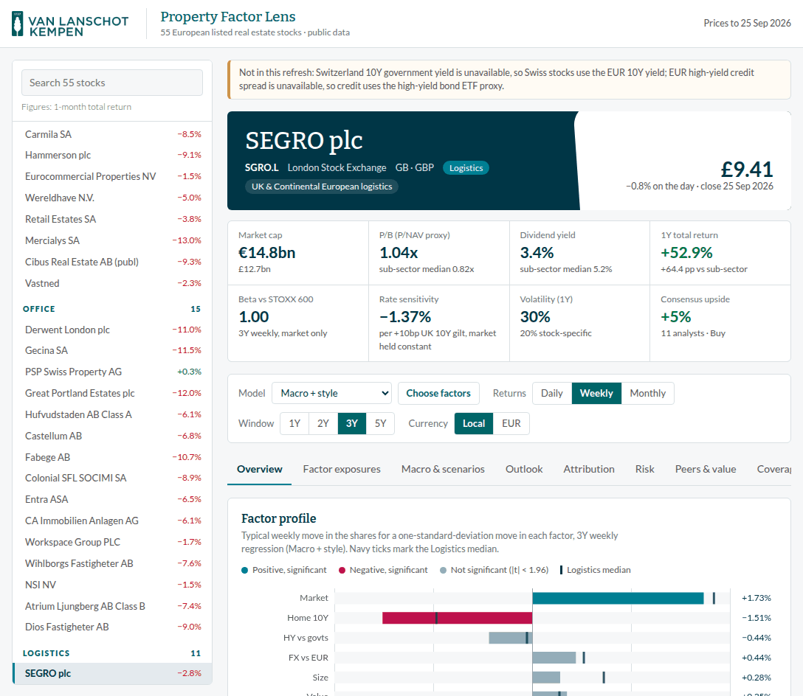
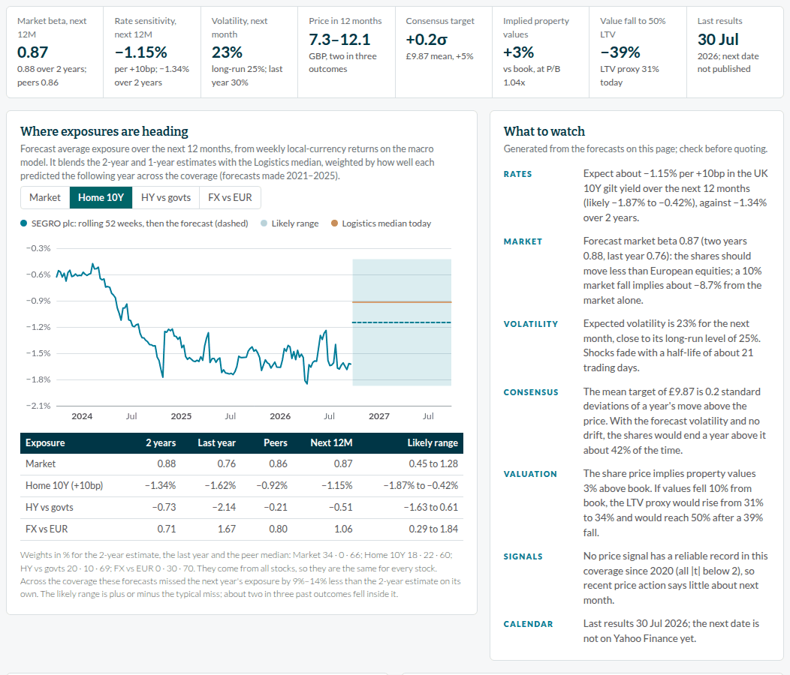

# Property Factor Lens

A factor exposure dashboard for the 55 European listed real estate stocks in the coverage list, built only on publicly available data. Pick any stock to see how it responds to the market, interest rates, credit and style factors; what drove its recent performance; how risky it is; and how it compares with its sub-sector on exposures, valuation and consensus. It is styled in the Van Lanschot Kempen house style.



## Opening the dashboard

| Option | How |
| --- | --- |
| Local, no install | Open `docs/index.html` in a browser. It reads the data file with a plain `<script>` tag, so double-clicking works. |
| Single shareable file | Download the `property-factor-lens` artifact from the latest **Refresh market data** run on the Actions tab, or build it with `python -m factor_dashboard.bundle`. One HTML file (about 3.6 MB) with the data, fonts and logo inside; e-mail it or drop it on SharePoint or Teams. |
| Always-current website | In the repository settings, open **Pages**, choose **Deploy from a branch**, pick the default branch and the `/docs` folder. The scheduled refresh then keeps the site current. |

## What the dashboard shows

The model, return frequency (daily, weekly, monthly), estimation window (1 to 5 years) and currency view (local or EUR) at the top apply to every view except the Outlook forecasts, which use fixed windows and follow only the currency setting.

| View | What it shows |
| --- | --- |
| **Overview** | Price and key figures (market cap, P/B, dividend yield, beta, rate sensitivity, volatility, consensus upside). Factor profile with the sub-sector median. Auto-generated takeaways for client conversations. Stock-specific return with z-scores. Performance against sub-sector, coverage and STOXX 600. Returns table and technicals. Valuation, balance sheet and consensus. Company profile. |
| **Factor exposures** | Full regression table with Newey-West t-statistics, sub-sector medians, ranks and variance shares. Each exposure plotted against all 55 stocks. Rolling exposures with ±2 standard error bands. |
| **Macro & scenarios** | Sensitivity to the home 10Y yield, EUR 2Y/10Y, curve, credit, FX, oil and volatility, both on its own and with the market held constant. Rate sensitivity over time against peers. A scenario builder (rates, equities, credit, FX, with optional correlated moves) that ranks all 55 stocks. Replays of stress episodes: COVID, the 2022 rate shock, the UK mini-budget, bank stress in 2023, the late-2023 rally, the 2025 German fiscal package and the 2025 US tariff shock. |
| **Outlook** | What to expect next. Forecasts of market beta, rate sensitivity, credit and FX exposure for the next 12 months, with a likely range and their track record across the coverage. A GARCH volatility forecast and the 12-month price range it implies, set against the consensus target. Property values implied by the share price, with NAV and LTV if values move, the value fall that takes LTV to 50% or 60%, and interest cover if debt costs rise. Price signals (momentum, reversal, low volatility, 52-week high) and how well each has predicted returns in this coverage. Auto-generated points to watch, including the next results date. |
| **Attribution** | Splits 1M to 3Y returns into factor contributions and a stock-specific part. Exposures are re-estimated monthly with no look-ahead and linked with the Carino method. Also compares stock-specific returns across the sub-sector. |
| **Risk** | Systematic and specific volatility, drawdown, VaR and expected shortfall. Where the variance comes from. Rolling volatility. Closest peers with pair-spread z-scores for pair ideas. Sub-sector correlation matrix. |
| **Peers & value** | Relative value scatter on any two measures (for example rate sensitivity against P/B) with a fitted line. Style characteristics as z-scores. Sub-sector peer table. |
| **Coverage** | Exposure heatmap for all 55 stocks. Sortable coverage table that can be copied to Excel. Sub-sector medians. |
| **Data & method** | Freshness and source of every input, and how each number is calculated. |



## Factors

| Group | Factors | Source |
| --- | --- | --- |
| Market | STOXX Europe 600 total return; real estate sector (cap-weighted coverage excluding the stock, orthogonalised to the market) | Yahoo Finance (iShares ETF) |
| Rates | Home 10Y government yield (EUR AAA curve for euro stocks; gilts, Swedish, Swiss and Norwegian yields for the rest), EUR 2Y and 10Y, 2s10s curve | ECB, Bank of England, Riksbank, SNB, Norges Bank |
| Credit | EUR high-yield option-adjusted spread, or high-yield bonds minus 3-5Y governments (ETF proxy) when FRED is unreachable | FRED, Yahoo Finance |
| FX and macro | Home currency against EUR, EUR/USD, Brent, equity volatility | Yahoo Finance |
| Style (academic) | Size, value, profitability, investment, momentum (European long-short portfolios) | Kenneth French Data Library |
| Style (ETF) | MSCI Europe value, momentum, quality, minimum volatility and mid-cap ETFs relative to the market | Yahoo Finance |

Presets: **Macro + style** (default), **Sector-relative** (adds the sector factor, so rate and style exposures are measured relative to real estate), **Real estate macro**, **Fama-French-Carhart**, **MSCI style ETFs**, **Market only**, or any custom combination.

## Coverage list

The coverage list is in `config/universe.csv`. It holds the Yahoo ticker, country, currency, sub-sector and segment for each stock. Edit it to add or remove names; the next refresh picks up the change. Some rows needed a judgment call:

- **Sagax.** The coverage list names *Sagax Real Estate Socimi SA*. That is AB Sagax's Spanish subsidiary, with a technical listing on Euronext Access (MLSAG.PA) and almost no free float. The dashboard uses the listed parent, AB Sagax B (SAGA-B.ST). Change the row if you meant the subsidiary.
- **Lumo Homes** is the former Kojamo. Its ticker changed from KOJAMO to LUMO on 16 March 2026, and Yahoo carries the full history under LUMO.HE.
- **Vastned** (VASTB) is the company formed when Vastned Belgium absorbed Vastned Retail on 1 January 2025. Yahoo no longer serves Vastned Retail's history, so the series starts at the merger.
- **Unibail-Rodamco-Westfield** moved its reference market to Euronext Paris on 14 April 2023. The pipeline tries Yahoo's legacy Paris symbol (UL.PA) for older history and otherwise starts in April 2023.

## Refreshing the data

The **Refresh market data** workflow (`.github/workflows/refresh-data.yml`) rebuilds `docs/data/dashboard_data.js` every weekday at 17:35 UTC, after the European close. It commits the result and uploads the single-file dashboard as a build artifact. It also runs whenever the pipeline or coverage list changes, and on demand from the Actions tab. Scheduled runs only fire on the repository's default branch.

To refresh locally:

```bash
python -m venv .venv && source .venv/bin/activate
pip install -r requirements.txt
python -m factor_dashboard.build          # about 8 minutes; --no-fundamentals is faster
python -m factor_dashboard.bundle         # optional: dist/property_factor_lens.html
```

When a source fails, the build reuses that series from the previous refresh and flags it in the dashboard. It refuses to overwrite the file if fewer than 80% of the stocks have prices.

## How the numbers are calculated

- **Returns.** Total returns (dividends reinvested) from Yahoo adjusted closes. Daily regressions use each stock's own trading days; weekly returns run Friday to Friday.
- **Exposures.** OLS with an intercept over the chosen window. t-statistics use Newey-West standard errors (Bartlett kernel, lag = floor(4·(n/100)^(2/9))), matching statsmodels. The Node tests check this against statsmodels output.
- **Attribution.** Exposure × factor return each day, with exposures re-estimated at each month start from the preceding window. Contributions are Carino-linked so they sum to the period return.
- **Risk.** Euler decomposition of exposure × factor covariance × exposure, plus residual variance.
- **Scenarios.** Shocks × macro exposures. With correlated moves on, unshocked factors take their conditional expectation given the shocks.
- **Exposure forecasts.** Every four weeks since 2021, each stock's 2-year and 1-year weekly exposures were recorded next to its sub-sector median and the exposure it showed over the following 52 weeks. A regression pooled across the coverage fits the weight on each; today's forecast uses the same weights. The likely range is plus or minus the typical forecast error. The view reports how much smaller the forecast errors were than the 2-year estimate's (9–14% smaller in September 2026). The peer median carries most of the weight: exposures drift strongly towards their sub-sector.
- **Volatility and price ranges.** GARCH(1,1) with variance targeting, fitted by maximum likelihood to three years of daily total returns. Price ranges assume no drift.
- **Implied property values.** The change in property values (total assets less cash) that would make IFRS equity equal to the market value. NAV and the LTV proxy are recomputed for other value changes.
- **Signals.** Monthly Spearman rank correlation (rank IC) between each signal and the next month's EUR total return across the coverage; t is the average IC over its standard error.
- **Fundamentals.** From the latest Yahoo statements, converted to the quote currency. P/B uses IFRS book value as a NAV proxy. The LTV proxy is net debt over total assets less cash. EBITDA ratios are dropped when Yahoo's EBITDA margin looks distorted by revaluations. Consensus targets and ratings are Yahoo's aggregates.

## Known limitations

- Yahoo Finance data is free but unofficial. Statements can be stale or in odd units; the pipeline corrects pence/pound and currency mix-ups and drops implausible ratios, so check key figures against company reports.
- The Fama-French factors arrive one to two months late. Recent attribution therefore defaults to market, sector, rates and credit, which are all current.
- FRED times out from GitHub's servers, so the credit factor currently uses the ETF proxy.
- The SNB yield series the pipeline reads stopped updating in July 2025, so Swiss stocks currently use the EUR 10Y yield as their rate factor. Any home yield more than three weeks stale is replaced the same way, and the note above each view says so.
- Yahoo no longer serves the pre-merger Vastned Retail line or URW's pre-April 2023 Amsterdam line, so those two histories are shorter.
- P/B and the LTV proxy approximate EPRA NTA and EPRA LTV; they are not the same measures.

## House style

The page follows the Van Lanschot Kempen brand book:

- **Type.** Bitter for headings, Lato for everything else, and capitals only for small spaced labels. Both fonts ship with the page under the SIL Open Font License (`docs/assets/fonts`), so no font service is needed and the shareable file renders correctly offline.
- **Colour.** Chart series use the brand's primary colours, starting with turquoise. Blue grey is pale on white, so it is kept for context: background peers and results that are not significant. Positive and negative exposures are turquoise and dark rose.
- **Tables.** Navy header bar in white Lato bold, grey hairlines and a navy closing rule. Returns and upside are in the signal colours: green for gains, red for losses.
- **Graphs.** Titles in Bitter semibold, bars with square ends on 25% grey tracks, dot markers in legends.
- **Identity.** The logo in the top bar (`docs/assets/img/vlk-logo.png`) and the rounded mirror shape in the stock header.

Two small departures, both for reading on screen: signal green and red are a shade deeper for small text (the brand book does the same for ochre with its online dark ochre), and there is no dark mode, since the brand is a light identity. Every colour is set once, as a token at the top of `docs/assets/styles.css`.

## Development

```
factor_dashboard/     data pipeline (sources, cleaning, fundamentals, build, bundle)
config/universe.csv   coverage list
docs/                 the dashboard (index.html, assets/, data/)
tests/                pytest for the pipeline, node:test for the analytics (tests/js)
```

```bash
pip install -r requirements-dev.txt
pytest
node --test tests/js/*.test.mjs
python tests/fixtures/make_ols_fixture.py   # regenerate the statsmodels reference results
```

ECharts 5.6.0 is vendored under `docs/assets/vendor` (Apache 2.0); Bitter and Lato under `docs/assets/fonts` (SIL Open Font License 1.1).

For research and discussion only; not investment advice.
